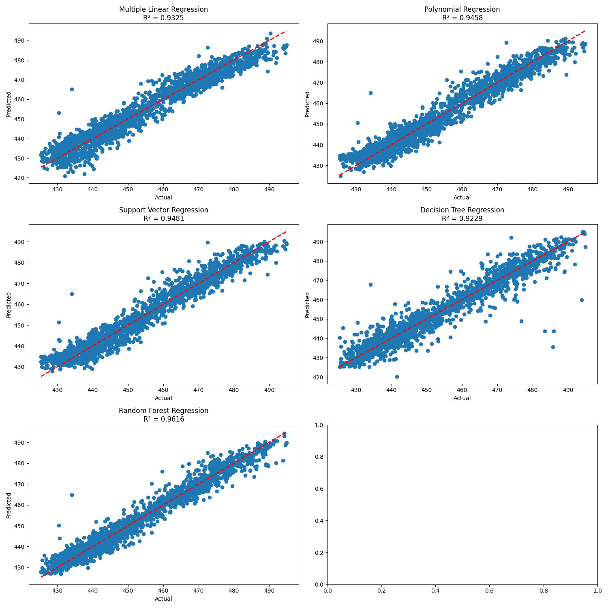
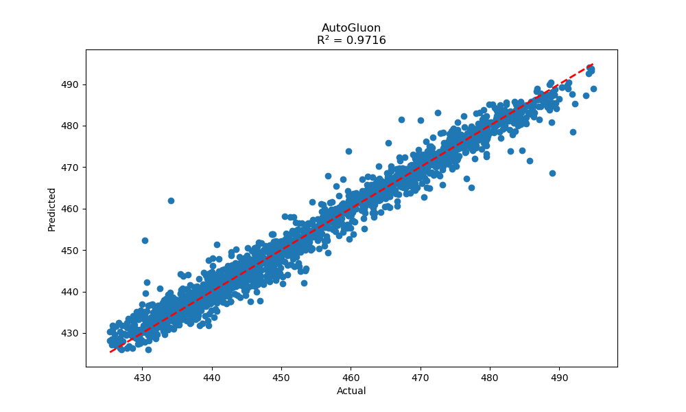
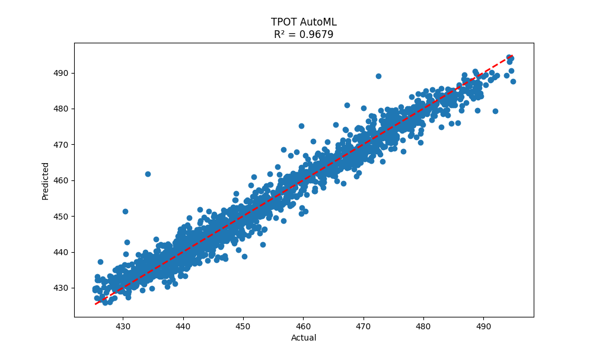

# Energy Production Prediction Model Comparison
This small project is an exploration into the potential of AutoML tools for quickly gaining insights into the best models for the data to then tune to enhance performance. The ease of deployment of AutoML tools is a testament to their usefulness for exploratory data analysis.

## Dataset Description

The dataset used in this project contains information related to energy production in a power generation system, likely a combined cycle power plant. The dataset includes the following features:

1. AT: Ambient Temperature (°C)
2. V: Exhaust Vacuum (cm Hg)
3. AP: Ambient Pressure (mbar)
4. RH: Relative Humidity (%)

The target variable is:

5. PE: Power Output (MW)

The goal is to predict the power output based on the given environmental conditions.

## Model Comparison

The exploration begins with a comparison of several traditional regression models to predict the power output. Following this, the data is processed using AutoGluon and TPOT, two well-known AutoML (Automated Machine Learning) tools, to discover potentially more sophisticated and effective models.

### Manual Models

Results:

| Model | R² Score |
|-------|----------|
| Multiple Linear Regression | 0.9325 |
| Polynomial Regression | 0.9458 |
| Support Vector Regression | 0.9481 |
| Decision Tree Regression | 0.9229 |
| Random Forest Regression | 0.9616 |

Among these models, Random Forest Regression performed the best with an R² score of 0.9616.

### AutoGluon

AutoGluon, an automated machine learning library, was used to find the best model. It achieved an R² score of 0.9716, outperforming all previous models.

The AutoGluon leaderboard can be found in the file `outputs/autogluon_leaderboard.csv`. The best model found by AutoGluon was a WeightedEnsemble_L2, which is a second-level ensemble that combines predictions from multiple base models, assigning optimized weights to each to maximize overall performance.

### TPOT (Tree-based Pipeline Optimization Tool)

TPOT, another automated machine learning tool, was also used to find the optimal model. It achieved an R² score of 0.9679.

The best pipeline found by TPOT can be found in the file `outputs/tpot_best_pipeline.txt`. TPOT's best model was an XGBRegressor, which is an implementation of gradient boosted decision trees.

## Conclusion

All models performed well in predicting the power output, with R² scores above 0.92. However, the automated machine learning approaches (AutoGluon and TPOT) outperformed the manually selected models:

1. AutoGluon (WeightedEnsemble_L2): R² = 0.9716
2. TPOT (XGBRegressor): R² = 0.9679
3. Random Forest (best manual model): R² = 0.9616

AutoGluon's ensemble model achieved the highest R² score, making it the best performing model for this dataset. This demonstrates the potential of automated machine learning tools in finding optimal models for regression tasks.

The high R² scores across all models suggest that the environmental variables (temperature, vacuum, pressure, and humidity) are strong predictors of power output in this system. This information can be valuable for power plant operators in predicting and optimizing energy production based on environmental conditions.

The success of ensemble methods (AutoGluon's WeightedEnsemble_L2) and boosting algorithms (TPOT's XGBRegressor) indicates that the relationship between the input features and power output is complex and benefits from combining multiple models or iterative improvements.